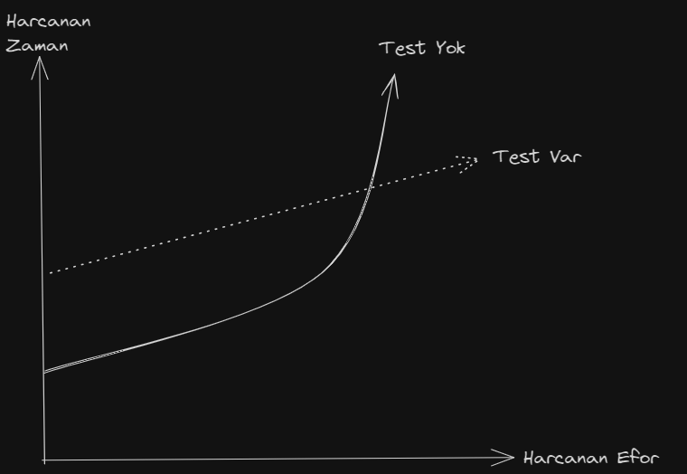
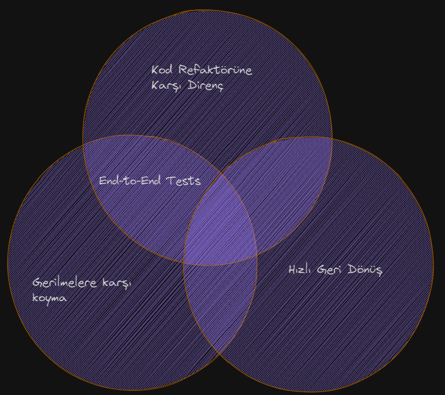
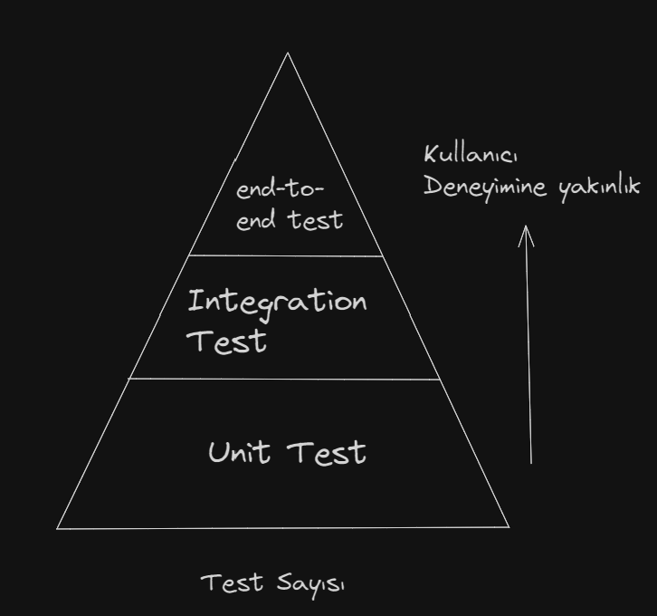

### Unit Test Çalışırken Aldığım Notlar.

### Unit Test Nedir ?

Unit Test, yazdığımız kodların en küçük parçalarını istediğimiz gibi sonuç verip vermediğini
doğruladığımız testlerdir. Bu testler her şeyden bağımsız ve izoledir.

### Unit Testin Amacı Nedir ?

Unit Test yazmamızdaki ana amaç kodun sürdürülebilirliğini sağlamaktır. Daha detay verecek olursam
çalıştığımız projelerin çoğu yıllar boyu geliştiriliyor ve büyük bir codebase'imiz oluyor. Bu kod
büyüdükçe bizim eski kodlara müdahele etmemiz riskli hale geliyor çünkü değiştireceğimiz yerin etki
ettiği birçok iş akışı olabilir. Eğer testimiz yok ise tek tek kodun nerelere etki ettiğini bulup
tekrar tekrar test etmemiz gerekir. Bu yöntem hem çok zaman alır. Kod bir saatli bomba gibi ne zaman
hata vereceği belli olmaz.

Grafikte görüldüğü gibi test yazmak zaman alan bir süreç ve ilk başlarda ilerlemenizi
yavaşlatacak bir yöntemdir. Ancak proje büyüdükçe eğer unit testiniz yoksa harcanan efor
gitgide artmaktadır. Belki de bir zaman sonra kodun içinden çıkılmaz bir hal alacaktır.



### Bir Unit Testi Ne İyi Ne Kötü Bir Test Yapar ?

Unit Test yazmak projenin bakımı için iyidir fakat iyi yazılmış bir unit test bunu sağlar. Kötü
yazılmış testler işleri yine işin içinden çıkılmaz bir hale getirecektir. Peki iyi unit test için
neler yapılmalı ;

- Öncelikle yazılan kodun çalışma mantığını çok iyi anlamak gerekir.
- En küçük bir değişiklikte bile unit testler tekrar çalıştırılmalıdır.
- Kodda bir refaktör işlemi yapıldıysa test kodlarında da refaktör yapılmalıdır.

### Test Kalitesini Ölçerken Test Coverage Araçlarını Kullanma

Test Coverage kodumuzun ne kadarının test edildiğini bize gösterir. Yüksek test covarage daha iyi
gibi genel bir algı vardır ama bu doğru değildir. İyi analiz edilmemiş, güvenli olmayan ve kalitesiz
testlerde code covarege artırır ama bu testin kaliteli olduğunu göstermez.
Code covarege hesaplanırken testi yazılmış kod satırı ile toplam kod satırının birbirine olan oranı ile hesaplanır. Bu hesap kod yazımına göre değişebilir ama mantık olarak aynı kapıya yol açsada code covarage oranı değişebilir.

```
function isEligible (int number)
{

 if(number > 3)
   return true;

 return false
}


it('is eligible test')
{
  bool result = isEligible(5);
  assert.equal(false,result)
}

```

Üstteki koddun code covarege oranı hesaplanırken test edilmiş kod satırı / toplam kod satırı. Bu işlem sonucu 4/5 = %80 code covarage diyebiliriz. (Hesaplanırken süslü parantezlerde dikkate alınmıştır.) Şimdi kodumuzda bir düzeltme yaptıktan sonraki haline bakalım.

```
function isEligible (int number)
{
   return  number > 2;
}


it('is eligible test'){
  bool result = isEligible(5);
  assert.equal(false,result)
}

```

Kodun refaktör edilmiş hali ile kod %100 code covarage ulaştı ama aslında kodun çalışma mantığında hiçbir değişim olmadı.

Bu örnek ile code covarage oranının yüksek olması ile test kalitesinin ve güvenilirliğinin kesinlikle doğru olmadığını bize göstermiştir.

### Branch Covarage Metric Nedir ?

Bir başka test covarage oranı hesaplama yöntemi denilebilir. Bu yöntem herkesin bildiğin code covarage hesaplama yönteminden daha doğru sonuçlar verir. Kod satırı toplamları ile değil kontrol yapısına odaklanarak hesap yapılır. Örneğin if veya switch'ler gibi. Branch covarage test = Gezilen branchler / toplam branchler. Örneğin

```
function isEligible (int number)
{
   return  number > 2;
}


it('is eligible test'){
  bool result = isEligible(5);
  assert.equal(false,result)
}

```

Örnek kodda iki tane durum (control) var diyebiliriz. İlki number'ın ikiden büyük olma durumu, ikincisi number'ın ikiden küçük veya eşit olma durumu. Yazmış olduğumuz test ise şuan sadece
bir tane durumu karşılıyor bu da branch code metric ile hesapladığımızda 1/2 = %50 code covarege sağlanmış olduğunu bize gösteriyor.

## Code Metric'lerindeki Problemler

- Kod metrikleri sistemin tamamen test altında olduğunu garanti etmez.
- Kod metrikleri kullandığınız kütüphaneleri teste dahil etmez.

## Başarılı Test Nasıl Yazılır ?

Aslında bu çok zor bir uğraş. Her olası durumu ele alıp tek tek tüm durumlar için test yazılmalıdır. Tabiki bu zaman ve maliyet olarak dezavantajlı olsada doğrusu budur.

## Unit Testin Anatomisi

### AAA Paterni

AAA paterni unit test yazarken bir standart haline gelmiş bir patterndir. Arrange, Act ve Assert anlamına gelir. Arrange aşaması testi gerçekletirmek için olan verilerin ayarlanması,
act aşaması fonksiyonun çağrıldığı ve son alan olan assert ise fonksiyondan aldığımız
sonucu doğrulama aşamasıdır. Örnek:

```
function sumOfTwoNumbers (int number)
{
   //Arange
   const number1 = 5;
   const number2 = 10;

   // Act
   const result = sum(number1,number2)

  // Assert
  expect(result).toBe(15);

}

```

Bu yaklaşım unit test yazmaya bir standart getirir ve kodun okunmasını kolaylaştırır.

### Given-When-Then Paterni

Bu paternde aslında aynı amaçla ortaya çıkmıştır unit test yazmayı bir standart haline
getirmek.
AAA Paternine karşılık gelen alanlar:

- Given = Arrange,
- When = Act
- Then = Assert

```
function sumOfTwoNumbers (int number)
{
   //Given
   const number1 = 5;
   const number2 = 10;

   // When
   const result = sum(number1,number2)

  // Then
  expect(result).toBe(15);

}

```

## Birden Çok Arrange, Act ve Assert bölümlerini önlemek.

Öncelikle bir unit test kodunda bu alanlardan hehrhangi birinin birden çok bulunması
kodda bir sıkıntı olduğunu gösteririr ve refactor edilmesi gerektiğini bizlere gösterir.

## Unit Testlerde if durumundan kaçınmak.

Aynı şekilde unit testin içinde if durumu bulunması bir anti-pattern'dir ve kaçınılması gerekir. Unit testlerimizi basit tutmalıyız.

## Kodları Yeniden Kullanma

Unit test yazarken girdi verilerine ihtiyacımız oluyor(arrange kısmı). Bu değerleri bir kere oluşturup daha sonra diğer testler içinde kullanabiliriz.

## Unit Test Isimlendirme

Unit Test fonksiyonunu isimlendirirken kodun nasıl davrandığını açıkca anlatmak gerekir. Birden çok isimlendirme standartı bulunmaktadır. Bunlardan birisi:
[MethodUnderTest]_[Scenario]_[ExpectedResult]

- MethodUnderTest kısmı test edilen metodun ismi
- Scenario metodun yaptığı iş
- ExpectedResult kısmı ise işlem sonucu beklenen çıktı

Bu isimlendirme standardı bazı zamanlarda işe yaramayabiliyor çünkü bazen detaylar yerine davranışı test etmemiz gerekiyor.

```
function void sum_of_two_numbers(){}
```

Bu test ismi gördüğünüz gibi standart'a uymuyor ama mantıklı ve açıklayıcı bir isimlendirme.

Unit Test Fonksiyonlarını isimlendirirken yapmamız gerekenler;

- Katı kuralları takip etmemize gerek yok. Bazı zamanlarda davranışı açıklamamız gerekebilir.
- Eğer uzun bir isim yazacaksak alt tire ile ayırmamız okunabilirliği artırır.

## İyi Bir Testin 4 Kuralı

- Gerilemelere karşı koruma
- Yeniden Düzenlemeye Karşı Direnç
- Hızlı Geri Dönüş
- Bakım Kolaylığı

Bu 4 kural sadece unit test için değil diğer test çeşitleri olan integration,end-to-end vb. testleri içinde geçerlidir. Şimdi bu 4 kuralı açıklayalım.

### İlk Kural: Gerilmelere Karşı Koyma (Protection against regressions)

Burdaki gerilmelereden kastımız kod içindeki bug'larımızdır. Bu kural aslında kodun devamlılığının sağlanmasıdır. Bir kod değiştiğinde diğer kod parçalarının çalışabilirliği bozulmaması gerekir. İyi yazılmış bir test bunu sağlar. Kod base büyüdükçede bug sayımız artar o yüzden bugların tespiti ve önlenmesi için ilk kuralın önemi büyüktür.

### İkinci Kural: Kod refaktörüne Karşı Direnç

Kodumuzu ve testlerimizi yazdığımızı düşünelim ve her şey çalışıyor. Sonra kodu daha iyi yazabileceğimizi düşündük ve bu da değişiklik ile kodun daha okunabilir ve ileriye dönük genişletilebileceğini düşündük ve kodun çalışma mantığını değiştirmeden, aynı çıktıları alacak şekilde yeniden yazdık. Her şey güzel ama unit testler hata vermeye başladı. Çünkü gözden kaçırdığımız yerler vardı. İşte iyi bir test bize bunun bilgisini verebilmelidir. Her bir kod değişikliğinde testler yeniden çalıştırılmalıdır ve hata riski en aza indirilmelidir.

### Üçüncü Kural: Hızlı Geridönüş Ve Sürdürülebilirlik

Unit Testlerimiz değişimlerde bize geri dönüş yapar ve iyi unit testler de bu değişimlerdeki hataları fixlememize olanak sağlar. Bu sayede kodumuz daha sürdürülebilir olur.

### Dördüncü Kural: Bakım Kolaylığı

İyi unit testler kodu daha anlaşılabilir kılar. Yazdığınız kodun çalışma mantığını başka birisi unit testler üzerinden anlamalıdır. Bu sağlanır ise kodun bakımı daha kolay yapılır.

#### Ideal test yazmak mümkün müdür ?

Bu başlıktaki ideal testten kasıt üste yazdığımız 4 tane kuralında sağlanmasıdır. Peki bu mümkün mü ? Maalesef bu durum mümkün değildir. Çünkü ilk 3 kural (Gerilmelere karşı koyma, kod düzenlemelerine karşı koyma ve hızlı geri dönüş) mantıken aynı anda gerçekleşemez. Bu durumun benzeri CAP Teoremiyle aynı mantıktadır.

Örnek : End-to-End Testler

End-to-End Testler tüm sistemin (Kullanıcı arayüzü, veritabanı, diğer araçlar) kullanıcı perspektifinde test edilmesidir. Bu testler birden çok yerden geçtiği için çok fazla kodu testten geçirirler. Bu yüzden de 4 kuraldan hızlı geridönüş kuralını sağlayamazlar çünkü çok fazla koddan geçtiği için hızlı bir geridönüş yapılamaz.



### Test Piramiti

Test piramiti bir konseptir. Bu konsept 3 unit test'in gösterimidir. Bunlar unit testler, entegrasyon testleri ve end-to-end testler.



Bu piramitin yatay kısmı test sayısını belirtir. Dikeye doğru olan kısmı ise kullanıcı deneyimine yakınlık olarak tanımlanabilir.

İlk katman olan unit test kısmı aslında en çok kod içeren kısımdır. Çünkü küçük bir kod parçasının bile tüm edge case'leri test edilir. Bu durumda kısa kodlar olsada çok fazla case çıkabileceği için test sayısı olarak en fazla kod içeren kısımdır. Ayrıca kullanıcı deneyimine yakın değildir sadece belli bir yerdeki kodun çalışmasını test ederler.

İkinci kısım olan entegrasyon testleri ise biraz daha işin içinde veritabanı veya diğer araçların girdiği kısımdır. Ve kullanıcı kullanımına bir adım yaklaşmış gibi oluyoruz. Örneği bir kullanıcı kayıt oluşturduğunda entegrasyon testleri ile veritabanına kayıt olup olmadığını test ediyoruz. Bu durumda kullanıcı deneyimine yaklaştığımızı gösteriyor. Bu katmanda test sayısı olarak unit testlerinden daha az test içerir.

Son katman olan end-to-end testler. Bu testler kullanıcı deneyimini birebir taklit eder tüm süreci test eder. Kullanıcının arayüzden başlattığı aksiyonun tüm yolculuğunu simüle eder ve bu test yaklaşımı kullanıcı deneyimine yaklaşmanın son noktasıdır. Test sayısı olarak daha az test içerir çünkü büyük bir sistemin farklı parçalarını içerir.

### Mock Veriler

Mock kavramı bir metodun veya verinin taklit edilmesidir. Test yazarken sürekli tüm istekleri gerçekleştirmek yerine oluyormuş gibi
yazabildiğimiz mock objeleri veya metodları bize kolaylık sağlar.

#### Stub İle Mock Arasındaki Fark

Stub, aynı mock gibi yine test'i oluyormuş gibi yaparak taklit etmemize olanak sağlar.

Mocklar ve stublar aslında bir test double metodudur. Test double, bir nesnenin yerine geçen, davranışlarını taklit eden nesneleri ifade eder. (Dummy veriler, Fake veriler, Stub, Mock, Spy)

Aralarındaki fark ise stub'lar belirli bir girdi karşısında sabit bir yanıt döndürmek için kullanılır. Daha basit ve çıktıyı direkt verir. Mock ise belirli bir metodun nasıl çağrıldığını izlemek, takip etmke için kullanılır ve her zaman geri veri döndürmek zorunda değildir.

Örnek;

- Bir mail sistemi olsun veritabanından veri çekip kullanıcıya mail atan bir sistem. Bu sistemde veritabanından veri çeken kodun testini yazarken, veriyi alırken ki kod, bu fonksiyon stub ile taklit edilebilir. Bu verileri kullanıcıya mail olarak atan kod ise mock kullanılarak test'i gerçkeleştirilebilir.

### Unit Test Stilleri
